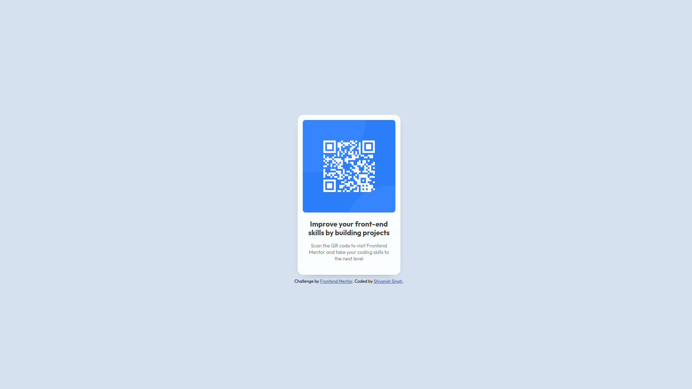

# Frontend Mentor - QR code component solution

This is a solution to the [QR code component challenge on Frontend Mentor](https://www.frontendmentor.io/challenges/qr-code-component-iux_sIO_H). 

## Table of contents

- [Overview](#overview)
  - [Screenshot](#screenshot)
  - [Links](#links)
- [My process](#my-process)
  - [Built with](#built-with)
  - [What I learned](#what-i-learned)
  - [Useful resources](#useful-resources)
- [Author](#author)

## Overview

### Screenshot

### Links

- Solution URL: [Add solution URL here]()
- Live Site URL: [Add live site URL here]()

## My process

### Built with

- Semantic HTML5 markup
- CSS custom properties
- Flex Box
- Mobile-first workflow

### What I learned

- Learnt the use of relative units like rem, ch, vw, etc.
- Learnt the use of Box Shadows

### Useful resources

- [MDN Docs](https://developer.mozilla.org/en-US/docs/Web/CSS/box-shadow) - This helped me with understanding Box Shadows
- [CSS Tricks](https://css-tricks.com/almanac/properties/b/box-shadow/) - This is a great article which helped me understand how to implement single direction box-shadow.

## Author

- Github - [Shivansh Singh](https://github.com/shivanshsinghx365)
- LinkedIn - [Shivansh Singh](https://www.linkedin.com/in/shivanshx365)
- Frontend Mentor - [@shivanshx365](https://www.frontendmentor.io/profile/shivanshsinghx365)
